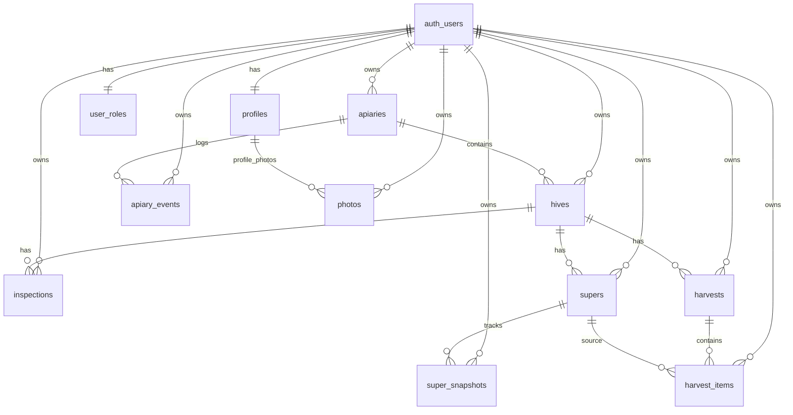

# GoldenBee Analytics

GoldenBee Analytics is a capstone project for **Software Technologies with AI (SoftUni AI)**.
It is a static SPA (URL-driven multi-page navigation) for beekeepers to manage apiaries, hives, inspections, supers, harvests, profile visibility, analytics, and profile photo uploads.

## Capstone Metadata

- **Author:** TODO
- **Email:** TODO
- **GitHub Repo:** TODO
- **Live Project URL:** TODO
- **Sample credentials (demo):** TODO

## Features

- Registration, login, logout with Supabase Auth
- Role model (`user`, `admin`) via `user_roles`
- Public/Private beekeeper profiles with moderation by admin
- Apiaries CRUD
- Hives CRUD within apiaries
- Hive inspections (date auto-generated server-side)
- Supers and super snapshots
- Harvests and harvest items
- Analytics reports (calibration and trend)
- Profile photo upload and open/download using Supabase Storage
- Bulgarian-first UI (`bg` default) with `en` fallback

## Tech Stack

- **Frontend:** HTML, CSS, JavaScript, Bootstrap, Bootstrap Icons
- **Backend:** Supabase (PostgreSQL, Auth, Storage)
- **Tooling:** Node.js, npm, Vite
- **Architecture:** Static SPA with client-side routing (History API)
- **Module system:** ES Modules

## Architecture Summary

- Single entry: `index.html`
- Bootstrap and app bootstrap: `src/main.js`
- Router and guards: `src/router/router.js`
- UI screens: `src/pages/<page>/<page>.js` + `<page>.css`
- Shared components: `src/components/*`
- Data access/services: `src/services/*`
- i18n: `src/i18n/i18n.js`, `src/i18n/bg.js`, `src/i18n/en.js`
- DB migrations: `supabase/migrations/*`

## Routes

- `/` Home (public directory)
- `/login`, `/register` (guest only)
- `/dashboard`, `/profile`, `/apiaries`, `/apiary?id=:id`, `/hive?id=:id`, `/analytics` (authenticated)
- `/admin` (admin only)
- Unknown routes -> Not Found screen

## Database Schema (Main Tables)

Core tables:

- `profiles`
- `user_roles`
- `apiaries`
- `hives`
- `inspections`
- `supers`
- `super_snapshots`
- `harvests`
- `harvest_items`
- `apiary_events`
- `photos`

### ER Diagram (high-level)



## Security

- Row-Level Security is enabled on all user data tables.
- Access control is owner-based by default and admin-based where needed.
- Role checks use `user_roles` and helper function `public.is_admin(uid)`.
- Admin moderation is enforced with policy + RPC (`admin_unpublish_profile`).
- Storage bucket `profile-photos` uses owner policies on `storage.objects`.

## Supabase Migrations

Schema is versioned through SQL migrations in `supabase/migrations/`.
Do not edit old migrations after they are applied; always add a new migration.

## Local Development Setup

### 1) Prerequisites

- Node.js 20+
- npm 10+
- Supabase project (or local Supabase stack)

### 2) Install dependencies

```bash
npm install
```

### 3) Configure environment

Copy `.env.example` to `.env` and set valid values:

```dotenv
VITE_SUPABASE_URL=...
VITE_SUPABASE_ANON_KEY=...
```

### 4) Run app

```bash
npm run dev
```

### 5) Build and preview

```bash
npm run build
npm run preview
```

## Deployment

- Netlify config is in `netlify.toml`
- SPA fallback redirect is configured (`/* -> /index.html`)
- After deploy, set and publish the **Live Project URL** in this README

## Key Folders and Files

- `src/pages/` — page modules (render + logic per screen)
- `src/services/` — Supabase data access and business operations
- `src/router/router.js` — route resolution, guards, navigation lifecycle
- `src/i18n/` — dictionaries and translation runtime
- `src/components/` — reusable UI parts (navbar, footer, toast)
- `supabase/migrations/` — database and RLS schema history

## Capstone Checklist

- [x] Multi-page URL-driven app with modular architecture
- [x] 5+ screens with responsive UI
- [x] Supabase DB with relationships and migrations
- [x] Supabase Auth (register/login/logout)
- [x] Roles + admin panel + RLS
- [x] Supabase Storage upload/download workflow
- [x] Public Git history with ongoing commits
- [ ] Live URL filled in metadata
- [ ] Demo credentials filled in metadata
- [ ] Author/email/repo metadata filled in
