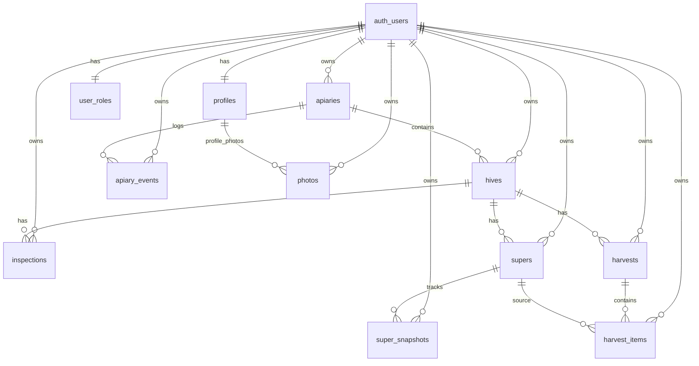

# GoldenBee Analytics

GoldenBee Analytics is a capstone project for **Software Technologies with AI (SoftUni AI)**.
It is a static SPA for beekeepers to manage apiaries, hives, inspections, supers, harvests, profile visibility, analytics, and profile photos.

## 📋 Project Description

GoldenBee Analytics provides practical, day-to-day beekeeping registry and hive journal workflows in one place.

**Key Features:**
- **Authentication**: Registration, login, logout with Supabase Auth
- **Role-Based Access**: `user` and `admin` roles via `user_roles`
- **Profile Management**: Public/private beekeeper profile visibility with admin moderation
- **Apiary Management**: Create and manage apiaries
- **Hive Management**: Create and manage hives inside apiaries
- **Inspections**: Record hive inspections with server-side date validation
- **Supers & Snapshots**: Track supers and super state over time
- **Harvest Tracking**: Manage harvest records and harvest items
- **Analytics**: Apiary and hive-level indicators and trends
- **Photo Storage**: Upload and manage profile photos in Supabase Storage
- **Internationalization**: Bulgarian-first UI (`bg` default) with English dictionary fallback

## 🏗️ Architecture

GoldenBee Analytics follows a modular static SPA architecture with URL-driven routing:

### Frontend
- **Framework**: Vanilla JavaScript (ES6 modules)
- **UI Library**: Bootstrap 5 + Bootstrap Icons
- **Build Tool**: Vite
- **Routing**: Custom History API router with auth/role guards
- **Structure**: Modular separation of pages, components, services, i18n, and utils

### Backend
- **Platform**: Supabase (Backend-as-a-Service)
- **Database**: PostgreSQL with versioned SQL migrations
- **Authentication**: Supabase Auth
- **Storage**: Supabase Storage (`profile-photos` bucket)
- **Security**: Row Level Security (RLS) policies and role checks

### Deployment
- **Hosting**: Netlify
- **Build Output**: `dist/`
- **SPA Redirects**: Configured in `netlify.toml` (`/* -> /index.html`)

### Technology Stack
```text
Frontend:
├── Vanilla JavaScript (ES6+)
├── Bootstrap 5
├── Bootstrap Icons
└── Vite

Backend:
├── Supabase
├── PostgreSQL
├── Supabase Auth
└── Supabase Storage

Development:
├── Node.js & npm
└── ES Modules

Deployment:
└── Netlify
```

## 🗄️ Database Schema Design

Main application tables:

- `profiles`
- `user_roles`
- `apiaries`
- `hives`
- `inspections`
- `supers`
- `super_snapshots`
- `harvests`
- `harvest_items`
- `apiary_events`
- `photos`

### ER Diagram (high-level)



### Security
- RLS is enabled on user data tables.
- Owner-scoped access is enforced through policies.
- Admin-specific actions use role checks and controlled RPCs.
- Profile photo access is controlled through storage policies.

## 🚀 Local Development Setup Guide

### Prerequisites
- Node.js 20+
- npm 10+
- Supabase project (cloud or local stack)

### 1) Clone and install dependencies
```bash
npm install
```

### 2) Configure environment variables
Create a `.env` file in the project root:

```dotenv
VITE_SUPABASE_URL=https://your-project-ref.supabase.co
VITE_SUPABASE_ANON_KEY=your-anon-public-key
```

### 3) Apply database migrations
Use Supabase CLI (recommended):

```bash
supabase link --project-ref your-project-ref
supabase db push
```

Current migration files:
- `20260228000100_initial_schema.sql`
- `20260228000200_002_beekeeping_core.sql`
- `20260302000100_profiles_admin_moderation.sql`
- `20260302000200_admin_unpublish_profile_rpc.sql`
- `20260303000100_profile_photos_storage.sql`
- `20260303000200_public_profile_photo_visibility.sql`
- `20260303000300_sync_public_hive_count.sql`
- `20260303000400_harvests_calibration_estimated_kg.sql`

### 4) Start development server
```bash
npm run dev
```

### 5) Build and preview production
```bash
npm run build
npm run preview
```

## 📁 Key Folders and Files

### Project Structure Overview

```text
Goldenbee-analytics/
├── index.html
├── package.json
├── vite.config.js
├── netlify.toml
├── README.md
├── src/
│   ├── main.js
│   ├── assets/
│   │   └── img/
│   ├── components/
│   │   ├── footer/
│   │   ├── navbar/
│   │   └── toast/
│   ├── i18n/
│   │   ├── bg.js
│   │   ├── en.js
│   │   └── i18n.js
│   ├── lib/
│   ├── pages/
│   │   ├── admin/
│   │   ├── analytics/
│   │   ├── apiaries/
│   │   ├── apiary/
│   │   ├── dashboard/
│   │   ├── hive/
│   │   ├── home/
│   │   ├── login/
│   │   ├── notfound/
│   │   ├── profile/
│   │   └── register/
│   ├── router/
│   │   └── router.js
│   ├── services/
│   ├── styles/
│   │   ├── app.css
│   │   └── variables.css
│   └── utils/
└── supabase/
    ├── config.toml
    ├── seed.sql
    └── migrations/
```

### File Descriptions

#### Root Files
- **`index.html`**: Single HTML entry point for the SPA
- **`package.json`**: Dependencies and scripts (`dev`, `build`, `preview`)
- **`vite.config.js`**: Vite configuration
- **`netlify.toml`**: Netlify build and SPA redirect rules
- **`README.md`**: Project documentation

#### Source (`src/`)
- **`main.js`**: Application bootstrap, app setup, and router startup
- **`router/router.js`**: Route map, guard logic, and URL navigation lifecycle
- **`pages/*`**: Screen-specific render/init modules
- **`components/*`**: Shared UI components (navbar, footer, toast)
- **`services/*`**: Supabase data access and domain operations
- **`i18n/*`**: Localization dictionaries and translation runtime
- **`utils/*`**: Shared helper utilities (DOM, navigation, date, formatting)
- **`styles/*`**: Global style tokens and app-wide styles

#### Supabase (`supabase/`)
- **`migrations/`**: Versioned SQL schema and policy migrations
- **`seed.sql`**: Seed data script (if used in your environment)
- **`config.toml`**: Supabase local/project configuration

## 🌐 Routes

- `/` → Home (public)
- `/login` → Login (guest only)
- `/register` → Register (guest only)
- `/dashboard` → Dashboard (authenticated)
- `/profile` → Profile (authenticated)
- `/apiaries` → Apiaries list (authenticated)
- `/apiary?id={apiaryId}` → Apiary details (authenticated)
- `/hive?id={hiveId}` → Hive details (authenticated)
- `/analytics` → Analytics (authenticated)
- `/admin` → Admin panel (admin only)
- `*` → Not Found page

## 🔧 Commands

```bash
npm install
npm run dev
npm run build
npm run preview
```

## 📝 Development Guidelines

- Keep modular boundaries between pages, services, components, and utils.
- Use ES modules consistently.
- Do not edit previously applied migrations; always add new migration files.
- Keep user-facing strings in i18n dictionaries, not hardcoded in services.
- Enforce auth and role checks both in router flow and database policies.

## ✅ Capstone Metadata (Fill Before Final Submission)

- **Author:** TODO
- **Email:** TODO
- **GitHub Repo:** TODO
- **Live Project URL:** TODO
- **Sample credentials (demo):** TODO
